# Hi there, I'm Safki! 👋

Welcome to my profile! I'm a passionate developer with over 3.5 years of experience in programming. I specialize in a variety of areas, and I'm excited to share my journey and expertise with you.

  
  
  

## About Me

I've been programming for over 3.5 years now. Most of my work revolves around:

- Web development (both pure code and no-code builders like WordPress and Funnelish)
- Automations (both pure programming and no-code tools like Make and Zapier)
- Scraping scripts
- Scripting (CLI/desktop development)

## Skills

The languages I'm proficient in and proud of are:

- JavaScript
- Python
- Ruby & Bash (mostly for my personal projects)
- HTML & CSS (essential for anything related to the web)

>Database-wise, I have worked with NoSQL more than SQL databases.

## Major Projects

Here are some of the biggest projects I've worked on in terms of financial impact:

- Building an account scraper for YouTube and TikTok based on a wide range of specific criteria 
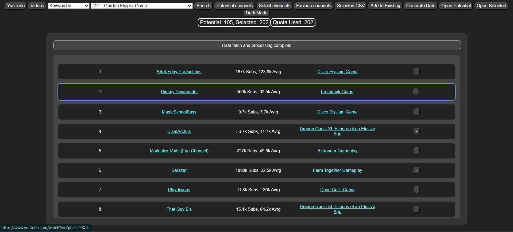 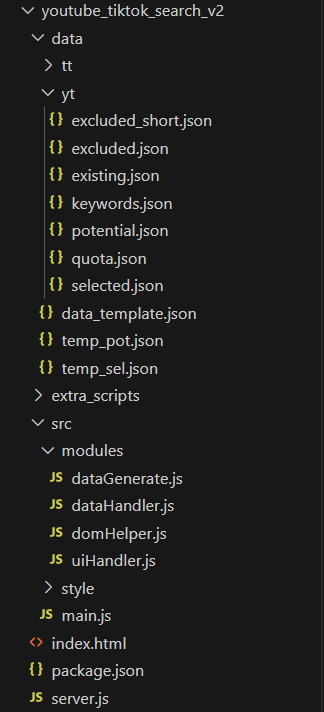
- Developing [International Mental Health Olympiad](https://internationalmentalhealtholympiad.com/) (WordPress - you can check out the site) 
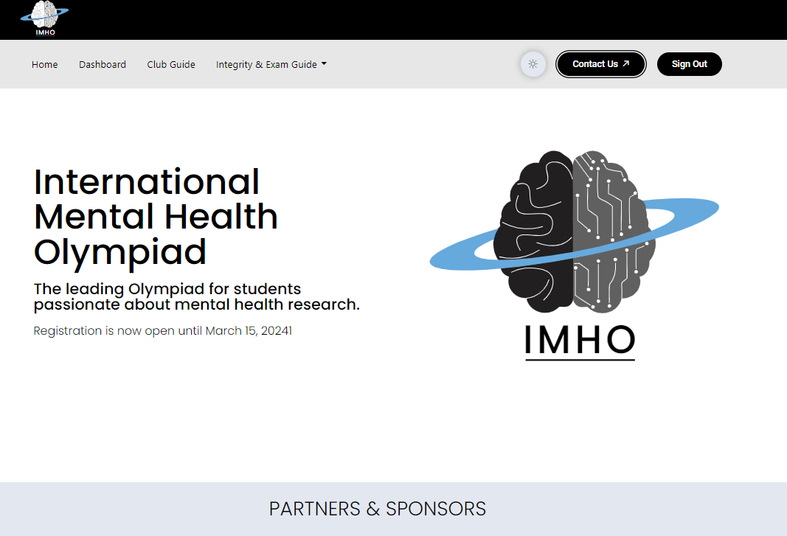
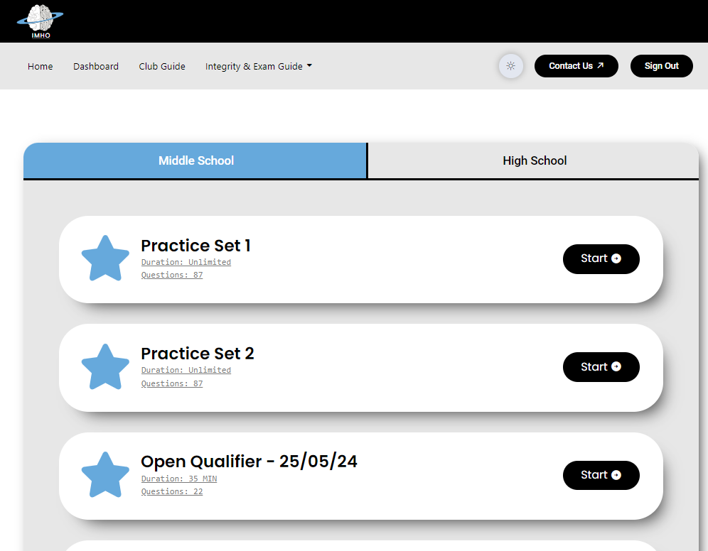
- Currently working on a YouTube video creation automation project, from text to video to upload. I believe this will be a major project in terms of complexity and integration with various tools.
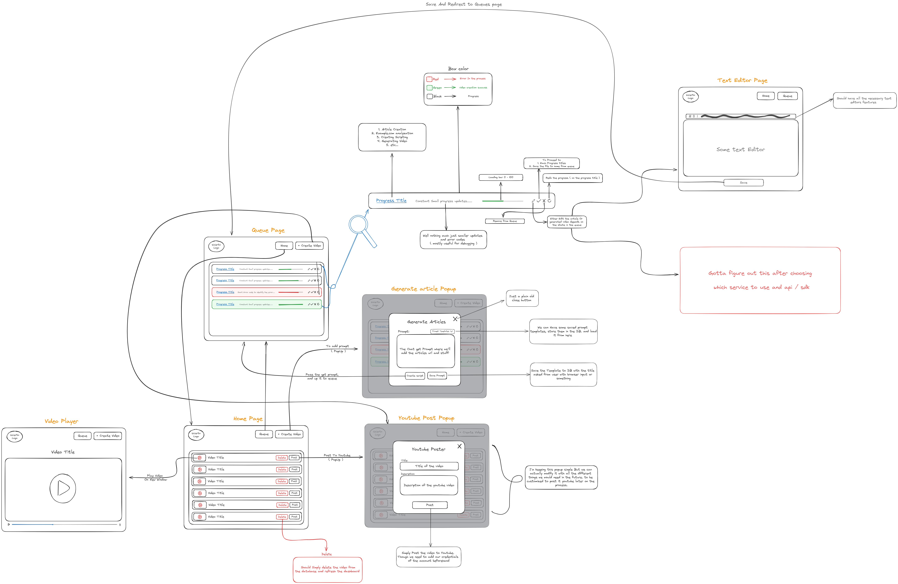

> In terms of the toughest projects, I haven't encountered any that I got stuck on and couldn't move forward with. However, there are a few that required a lot of time and testing. Here are some purely programming-related ones:

## Personal Projects

**_The following projects still have a few updates pending. Since they were personal projects, I got busy and left them as they are. Everything is on my [GitHub](https://github.com/dhextras), feel free to check them out._**

- A group chat with basic functionalities (created to show off to my sister LOL) - [Group Chat](https://dhextras-chat.glitch.me/) (users can join using the same room ID, try using `Kyle-Test` for room ID, just made one for you.)
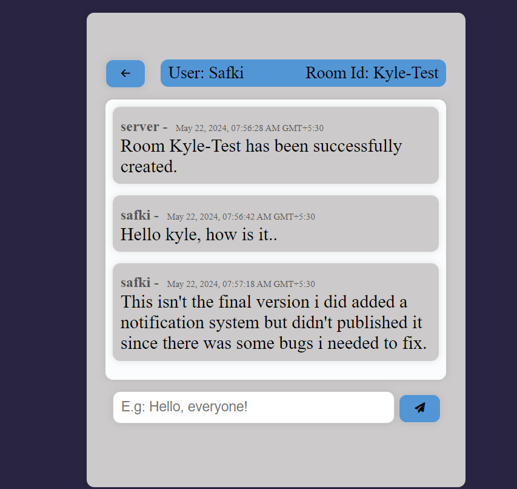
- A cool-looking file visualizer - [File Visualizer](https://file-viz.glitch.me/) (try it out in desktop Chrome)
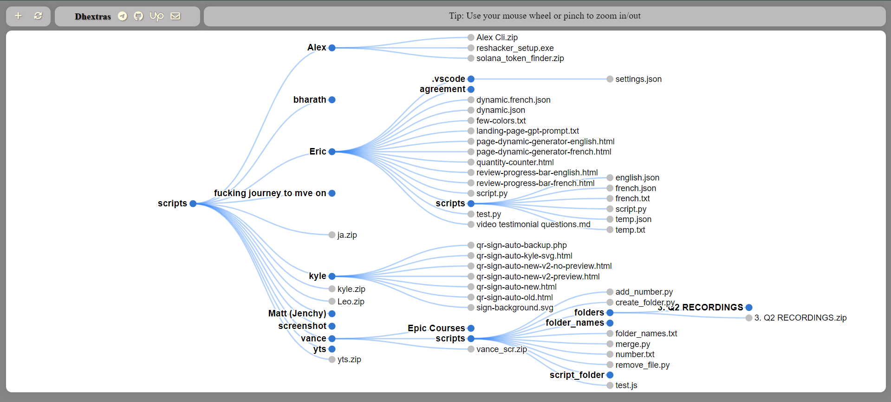
- Age timer desktop utility that counts your age in real time - [Age Timer](https://github.com/dhextras/age-timer-tauri)
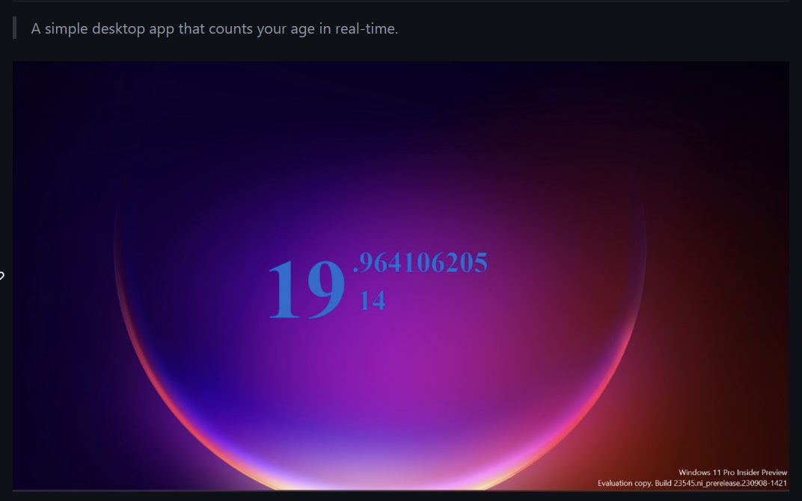
- Freight pallet calculator (this was a bit complicated, and it's for my client, but he agreed to make it open source) - [Freight Pallet Calculator](https://dhextras.github.io/freight-pallet-calc/)
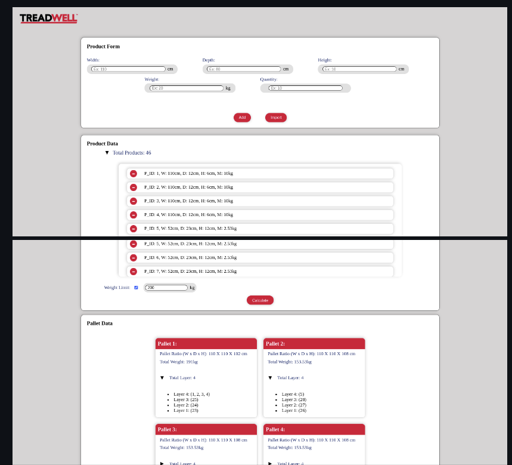
- Configmate - a bash CLI, not much to talk about - [Configmate](https://github.com/dhextras/configmate)

## Client Projects

- Several automations and scrapers (Jira, Confluence, Sheets, Docs, Gmail, Calendar automations, and more)
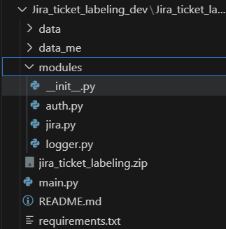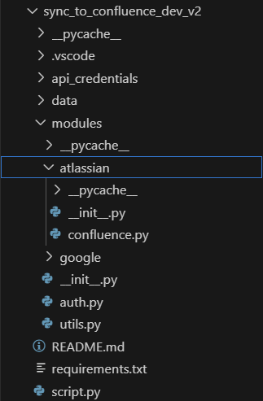
- Solana token finder and buyer (CLI tool with a single executable for Windows)
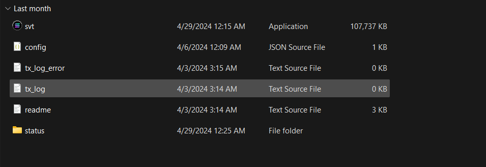
- Fixed/updated numerous programs with new features and bugs.

> **_I think that covers it. Honestly, the skill I'm most proud of is my ability to learn new things on the project and deliver in a timely and efficient manner. As long as the client provides a starting point, I will go all the way to solve their problem._**
